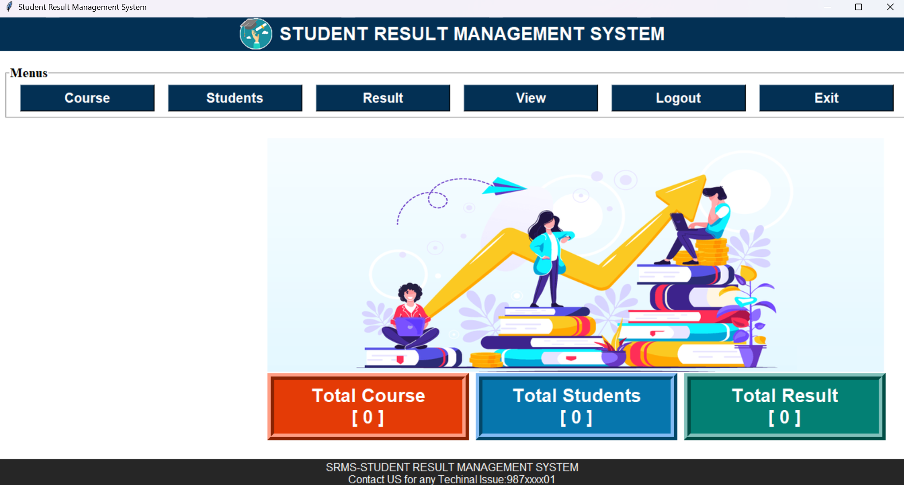

# 🎓 Student Management System

A desktop-based Student Management System built using **Python** and **Tkinter** that allows users to manage student records efficiently. This project demonstrates the use of GUI development in Python along with basic file/data handling operations.

---

## 💡 Why I Built This

This project was created to **explore GUI development with Tkinter** and to apply Python in a real-world use case — managing student records. It helped me strengthen my understanding of:
- GUI widgets and layout management
- Event handling
- Data input/output
- Form design and validation

---

## 🖼️ Screenshot

Here’s a quick look at the GUI interface of the application:

  

> 📝 Make sure `screenshot.png` is in the same directory as your `README.md` file.

---

## 📌 Features

- Add new student records
- Update existing records
- Delete student records
- View all student data
- Simple and clean Tkinter GUI
- (Optional) Search student by name or ID

---

## 🧠 Concepts Used

- **Tkinter** – for building the graphical user interface
- **Functions and Events** – for button clicks and user input handling
- **List/Data Storage** – to manage student data in memory (or file)
- **Labels, Entries, Buttons, Frames** – Tkinter widgets
- **Grid/Pack Layouts** – for placing elements on the screen

---

---

## 💻 Running in VS Code

To run this project in Visual Studio Code:

1. Open the project folder in VS Code
2. Make sure `student.py` is selected
3. Click the **Run ▶️** button in the top right corner, or press:
   - `Ctrl + F5` – Run without debugging
   - `F5` – Run with debugging
4. The Tkinter GUI will launch in a separate window

No external dependencies needed — only Python and Tkinter!

---
